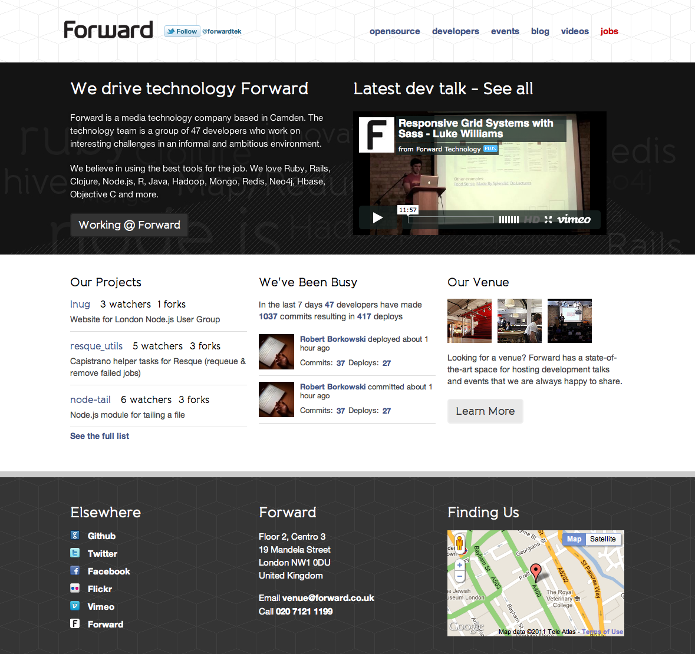

3 Years of Continuous Delivery
==============================

[Thoughtworks](http://thoughtworks.com) recently come to [Forward] (http://forward.co.uk) discuss the recent [Continuous Delivery](http://amazon.co.uk) book and application. It spurred me into thinking about how we deliver software across Forward and how radically different it is from anywhere else I have worked. From my first day 3 years ago we continuous delivery has been part of how we build software and is now just an implicit assumption about how teams will work. We have always wanted to test new ideas, features, even as soon as possible and have striven to get them live as sson as possible.  

It has allowed our teams to move quickly and show, enabled experimentation, and seen the value of decisions quickly. 

The effects of continuous delivery fall into three areas. Its symbiotic relationship with our culture, products and people; it is effecting the way we architect systems and what we actually see continuous delivery as. 

Forward
-------

Previously I have tried to define what made the teams at Forward so effective, Fred George has since labeled this "programmer anarchy". Personally the way we work can be broken down into 4 parts, and is key to understanding how we are able to make continuos delivery work.

1. **"T Shaped People"** We value people with an expert level of skill in a area but with the passion and self awareness to realise that they need a number of complimentary, tangential skills to be as effective as possible.

1. **Just Enough Process** Agile processes are these to solve a number of problem, to improve communication, direction, management etc. However with small teams of self motivated experts many of them fall away and the teams are able to focus soley on delivery.

1. **Experimentation** Forward contstanly experiments. From spiking out new technology to solve problems in new ways, to trying out new business ideas and how teams are organised.

1. **Focus on business value** Developers need to know the measures of success so they are able to make effective decisions on projects. 

These development values have evolved over my last three years at Forward. The implicit push for continuous delivery has been a factor in driving us towards them. This has effected the people we hire and they have have continued to effect how we deliver. 

Continuos Delivery at Froward
-----------------------------

We brag at little about continuous delivery on [our technology website](http://forwardtechnology.co.uk) but probably not enough. On that example day when I took the screen shot we were deploying to a live production environment every 5 minutes.

Effects of Continuous Delivery
------------------------------

The effects of working this way have been quite significant and fall into 3 main areas.

- **Development Process**
- **Architectural**
- **Company**

- **Automate Everything**
- **Single Delivery Team**
- **Monitoring and Logging**
- **Reduced Feedback Loop**
- **Monitoring and Logging**
- **Roll Forward**

