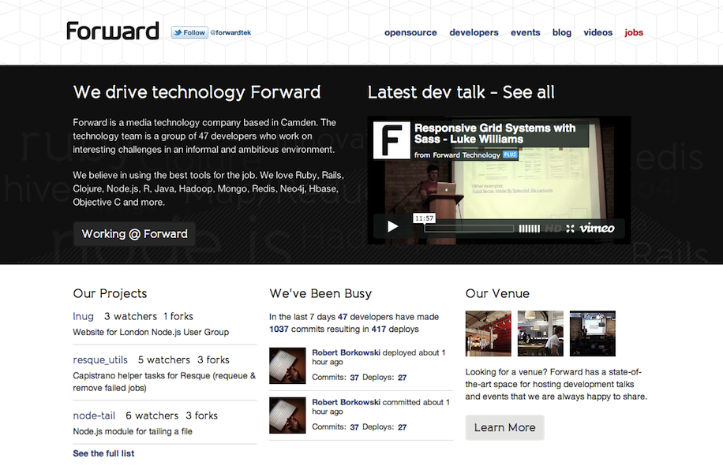
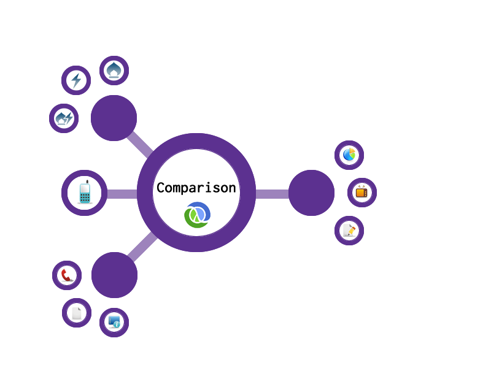
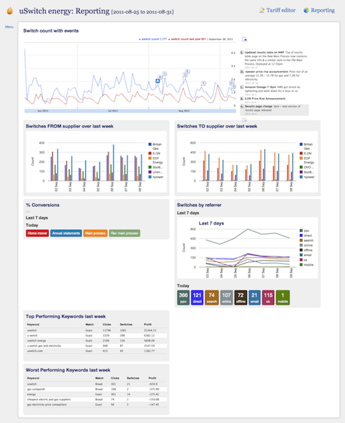
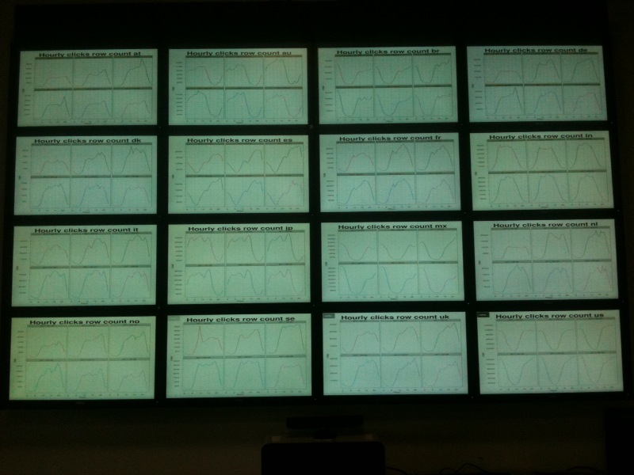
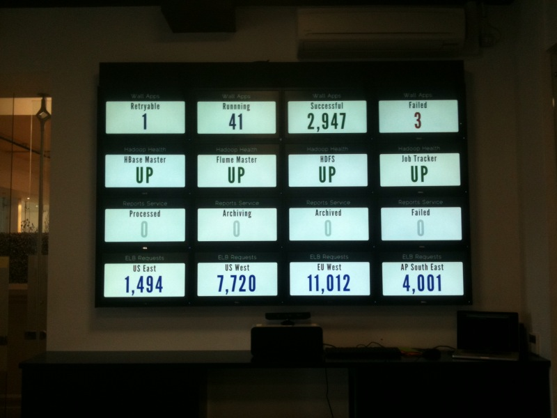
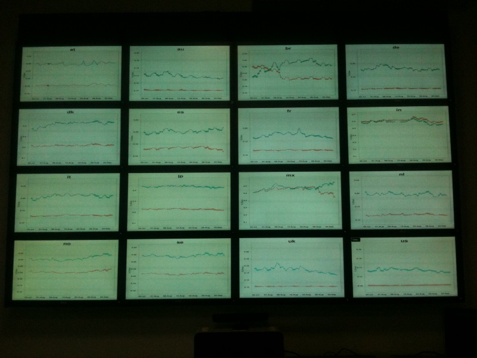
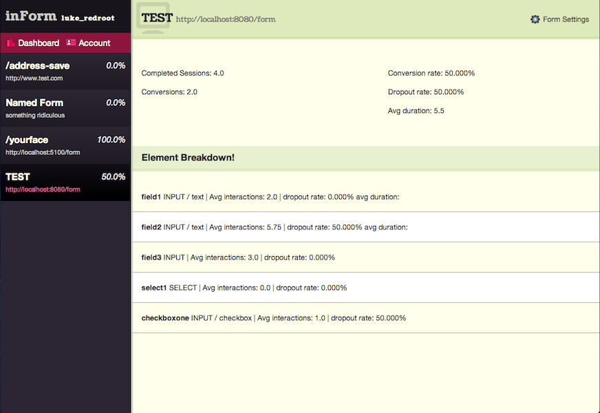

!SLIDE

@michael_jones
==============
[http://michaeljon.es](michaeljon.es)
-------------------------------------

!SLIDE

Continuous Delivery
===================

!SLIDE

3 Years of Continuous Delivery
==============================
<!-- - or 3 years of Continuous Delivery without testing *

<small>* there is some testing</small> -->

!SLIDE

Overview
========
- Forward culture
- What continuous delivery is to us
- How continuous delivery is effecting us

!SLIDE

Forward
=================
- T shaped people
- Just enough process
- Experimentation
- Developer focus on KPIs

!SLIDE

Continuous Delivery
===================
- At the centre of how we work
- Implicit assumption

!SLIDE

!SLIDE

How do we do this? 
==================
- Automate everything
- Single delivery team
- Keep the feedback loop to minutes
- Push test to users Testing
- Monitoring and logging
- Roll forward

!SLIDE

Effects Continuous Delivery
===========================
- Architectural
- Process
- Company

!SLIDE

Architectural Changes
=====================
- Small, composable, disposable systems
- Prefer not to create binaries
- Plain text communication
- HTTP integration

!SLIDE

!SLIDE

Process Changes
===============
- Keep the feedback loop to minutes
  - Current analytics too slow
- Prefer feedback from users than tests
- Monitoring and Log everything
  - Helped us understand how people use the site
  - Shows you if you are getting it right
- Dashboards visualising KPIs 

!SLIDE

!SLIDE

"Companies mirror their architecture" 
===================================
Dan North

!SLIDE

!SLIDE

!SLIDE

!SLIDE

Future
======
- Log more
- Model user interaction with applications

!SLIDE

    
!SLIDE

Summary
=======
- Limit deployment impact
- Reduce feedback loop
- Monitoring and logging is key
- Focus on business outcomes not development ones

!SLIDE

Questions?
==========

  

